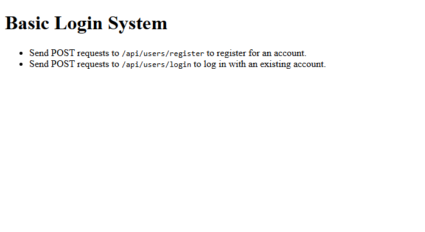

# Lab 14.1: Basic Login System

[Karl Johnson](https://github.com/hirekarl)  
2025-RTT-30  
<time datetime="2025-08-26">2025-08-26</time>  



## Overview
### Viewer Instructions
1. In the terminal, run:

```bash
cd basic-login-system && npm i && npm run dev
```

2. Send POST requests to http://localhost:3001/api/users/register to register for a new account; send POST requests to http://localhost:3001/api/users/login to login with an existing account.

### Submission Source
Top-level application behavior can be found in [`./basic-login-system/server.js`](./basic-login-system/server.js).

### Reflection
> TODO

## Assignment
The user portal for “Innovate Inc.” needs its core authentication feature. Before you can build out more complex functionality, you need to create the fundamental endpoints for user registration and login. Your task is to build a simple Express API that can:
1. Accept a new user’s credentials and create a user record with a hashed password.
2. Accept a returning user’s credentials, validate them against the stored hash, and issue a JWT upon success.
